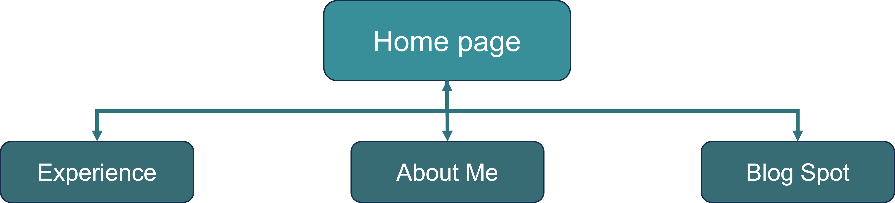
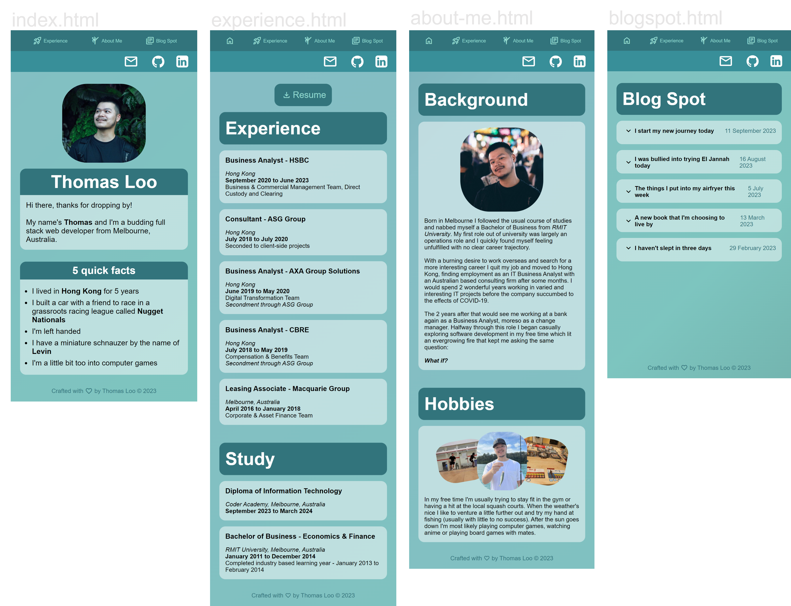
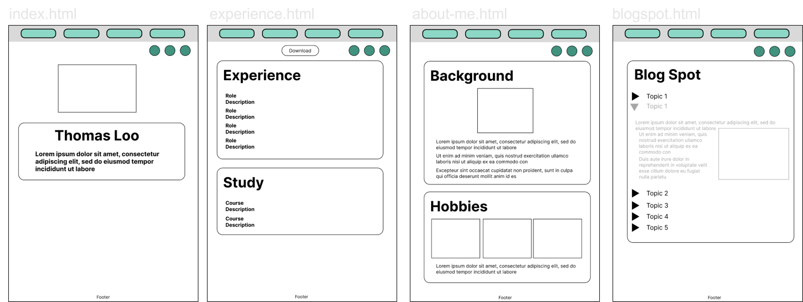

# Coder Academy Assignment T1A2 - Portfolio Website - Thomas Loo

## Links
[Published portfolio](https://neggfriedrice.github.io/Portfolio/index.html)  
[GitHub repository](https://github.com/NeggFriedRice/Portfolio)  
[Portfolio documentation](/ppt/Thomas-Loo-Portfolio-Presentation-T1A2.pdf)  

## Purpose
This portfolio is a digital showcase to present:
- Who I am
- What type of experience I have
- What type of studies I have completed
- My contact details
- Additional information about me outside of work
- Blog posts about my thoughts

Aside from sharing my information to the target audience, this portfolio serves as a display of what I can do as a full stack web developer allowing me to quickly share my design choices, my personality and most importantly my ability to code in a visual format.

## Target Audience
The main target audience for this portfolio is for:
- Prospective employers
- Software developers

## Functionality and Features
This is website utilisess a fully responsive design which is optimised for mobile, tablet and desktop viewing.

Semantic tags are used within the HTML to increase accessibility.

A navigation bar with clear labels is fixed to the top of the viewport on every page and is available to navigate between pages.

A social links bar with recognisable icons are also available on the top of every page should the viewer wish to find contact information.

Elements in each page have been styled with animations to provide an enhanced viewing experience upon page load.

Interactive elements have been animated to grow or change colour to indicate that they can be clicked or hovered to reveal additional information.

## Tech Stack
- HTML
- CSS
- GitHub Pages

## Site Map

## Site Screenshots

## Wireframes
